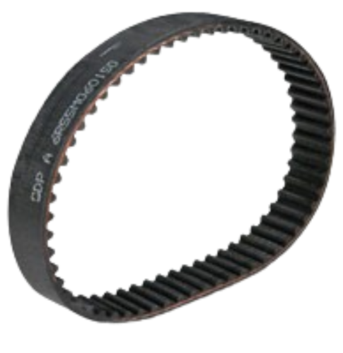

# Motor

I'm using a GT2 timing belt for power transmission. For all the details, you can refer to the table below:

| Property | Value |  
|----------|-------|  
| Name | GT2 Timing Belt |  
| Tooth Pitch | 5mm |
| Belt Width | 6mm | 
| Total Teeth | 58 |  
| Material | Neoprene | 
| Length | (**Total Teeth × Tooth Pitch**) = **290mm** |

 

I spent a lot of time figuring out if I joining an open-ended timing belt is possible and if it could handle the load from the motor. Short answer is HELL NO!. It would always snap out and break. Took me 15-20 tries until I realized, it's time to cut the [main frame](../cad-files/main_frame.stl) and place a closed belt.

YOU CANNOT JOIN AN OPEN ENDED TIMING BELT TO MAKE IT A CLOSED ONE, NO MATTER WHAT.